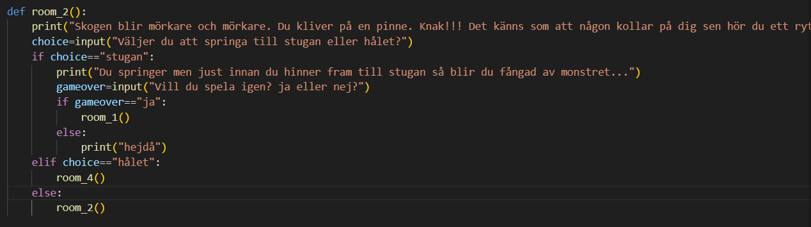

# Titel

Hjalmar Edlund

## Inledning

Jag har gjort ett text äventyr. jag använde mig av def för att skriva kod.

## Bakgrund

Jag började med att försöka hitta på något att göra. Jag googlade och ett text äventyr kom upp som en bra sak att göra. jag letade efter inperation och jag hittade någon på github som använde def funktionen. Jag började skrva min kod genom att definera ett rum och i det rummet får man skriva vad man vill göra, baserat på vad man gör så blir man skickat till ett annat rum. kolla på bilden om du tycker jag är dålig på att förklara.

## Positiva erfarenheter

Jag tyckte min äventyr vad bra och jag lärde mig define funktionen.

## Negativa erfarenheter

Om jag skulle vilja ändra någoting nu så skulle de ta evigheter för jag skulle behöva göra det på alla rum.

## Sammanfattning

Jag har skapat ett rolig text äventyr som använder sig av def funktionen.